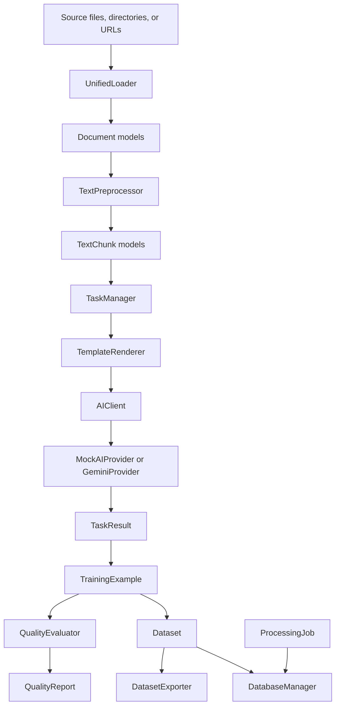

# Architecture

The Training Data Bot package is organized as a layered local pipeline. Each layer has a small public surface and passes typed models to the next layer. The current architecture is offline-first by default.

## Loader Layer

Primary module: `src/training_data_bot/sources`

Responsibilities:

- Load one file, one URL, or a directory of supported files.
- Route source types through `UnifiedLoader`.
- Convert raw content into `Document` models.
- Keep file discovery deterministic and sorted.
- Interpret directory `file_patterns` as inclusion glob patterns.
- Raise domain exceptions for missing files, unsupported formats, malformed inputs, and missing optional dependencies.

Supported source types:

- TXT
- MD
- HTML
- JSON
- CSV
- DOCX
- PDF
- URL fallback

## Preprocessing Layer

Primary module: `src/training_data_bot/preprocessing`

Responsibilities:

- Normalize text consistently.
- Strip configured control characters.
- Preserve or collapse paragraph breaks according to configuration.
- Chunk text with configurable size and overlap.
- Preserve document metadata in chunk metadata.
- Generate stable deterministic UUIDv5 chunk IDs.

Output model: `TextChunk`.

## Task/AI Layer

Primary modules:

- `src/training_data_bot/tasks.py`
- `src/training_data_bot/ai.py`

Responsibilities:

- Store default task templates for current `TaskType` values.
- Render prompts with strict variable substitution.
- Execute prompts through an `AIClient` abstraction.
- Use `MockAIProvider` by default for offline, deterministic local behavior.
- Support an opt-in `GeminiProvider` that reads `GEMINI_API_KEY` from the environment only.
- Return structured `TaskResult` records.

This layer does not perform quality scoring, dataset export, storage persistence, embeddings, or advanced orchestration.

## Quality Evaluation Layer

Primary module: `src/training_data_bot/evaluation.py`

Responsibilities:

- Evaluate individual `TrainingExample` records.
- Evaluate aggregate dataset quality.
- Populate `QualityReport.metric_scores`, `issues`, `warnings`, and `reasons`.
- Apply deterministic rule-based checks for:
  - relevance
  - coherence
  - diversity
  - bias
  - toxicity

This layer is offline and does not call external APIs.

## Export Layer

Primary module: `src/training_data_bot/storage.py`

Primary class: `DatasetExporter`

Responsibilities:

- Export datasets as deterministic JSONL or CSV.
- Validate export format and output suffixes.
- Reject unsupported placeholder formats with clear `ExportError` messages.
- Optionally create deterministic train/validation/test split packages.
- Preserve training example metadata and quality scores in exported records.
- Update dataset export metadata such as `export_path`, `export_format`, and `exported_at`.

Implemented formats:

- JSONL
- CSV

Placeholder enum values:

- Parquet
- Hugging Face
- OpenAI

## Local Storage Layer

Primary module: `src/training_data_bot/storage.py`

Primary class: `DatabaseManager`

Responsibilities:

- Persist datasets and processing jobs as local JSON files.
- Load one persisted dataset or job by ID.
- List persisted datasets and jobs in deterministic filename order.
- Serialize UUID, enum, datetime, and `Path` values into JSON-safe forms.
- Raise `StorageError` for missing, malformed, invalid, or unwritable records.

Default storage layout:

```text
output/storage/datasets/{dataset_id}.json
output/storage/jobs/{job_id}.json
```

Storage is local, offline-first, dependency-free, and intended for durable tutorial workflows. It is not a production database, concurrent writer system, migration framework, cloud object store, or query engine.

## Main Data Flow



`TrainingDataBot` orchestrates these layers through `load_documents()`, `process_documents()`, `evaluate_dataset()`, `export_dataset()`, `load_dataset()`, `list_persisted_datasets()`, `load_job()`, `list_persisted_jobs()`, `quick_process()`, and `cleanup()`.

## Remaining Architecture Gaps

- Decodo integration remains stubbed/fallback-only and is not production scraping behavior.
- `TextChunk.embeddings` and `TextChunk.topics` fields exist, but no embeddings or topic extraction pipeline is implemented.
- Parquet, Hugging Face, and OpenAI export enum values are placeholders.
- Dataset statistics fields are present but not fully populated by a dedicated lifecycle layer.
- No CLI, package metadata, or deployment surface is implemented.
- No schema migration layer exists for persisted JSON records.
