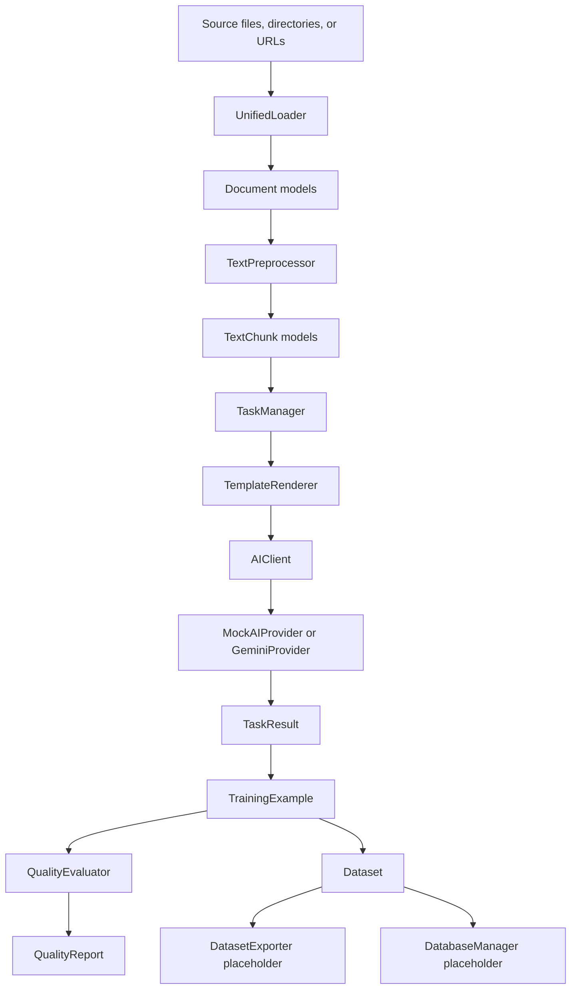

# Architecture

The Training Data Bot package is organized as a layered local pipeline. Each layer has a small public surface and passes typed models to the next layer.

## Loader Layer

Primary module: `src/training_data_bot/sources`

Responsibilities:

- Load one file, one URL, or a directory of supported files.
- Route source types through `UnifiedLoader`.
- Convert raw content into `Document` models.
- Keep file discovery deterministic and sorted.
- Interpret directory `file_patterns` as inclusion glob patterns.
- Raise domain exceptions for missing files, unsupported formats, malformed inputs, and missing optional dependencies.

Supported source types:

- TXT
- MD
- HTML
- JSON
- CSV
- DOCX
- PDF
- URL fallback

## Preprocessing Layer

Primary module: `src/training_data_bot/preprocessing`

Responsibilities:

- Normalize text consistently.
- Strip configured control characters.
- Preserve or collapse paragraph breaks according to configuration.
- Chunk text with configurable size and overlap.
- Preserve document metadata in chunk metadata.
- Generate stable deterministic UUIDv5 chunk IDs.

Output model: `TextChunk`.

## Task/AI Layer

Primary modules:

- `src/training_data_bot/tasks.py`
- `src/training_data_bot/ai.py`

Responsibilities:

- Store default task templates for current `TaskType` values.
- Render prompts with strict variable substitution.
- Execute prompts through an `AIClient` abstraction.
- Use `MockAIProvider` by default for offline, deterministic local behavior.
- Support an opt-in `GeminiProvider` that reads `GEMINI_API_KEY` from the environment only.
- Return structured `TaskResult` records.

The current task layer does not perform quality scoring, dataset export, storage persistence, embeddings, or advanced orchestration.

## Quality Evaluation Layer

Primary module: `src/training_data_bot/evaluation.py`

Responsibilities:

- Evaluate individual `TrainingExample` records.
- Evaluate aggregate dataset quality.
- Populate `QualityReport.metric_scores`, `issues`, `warnings`, and `reasons`.
- Apply deterministic rule-based checks for:
  - relevance
  - coherence
  - diversity
  - bias
  - toxicity

This layer is offline and does not call external APIs.

## Export And Storage Placeholders

Primary module: `src/training_data_bot/storage.py`

Current responsibilities:

- Provide importable `DatasetExporter` and `DatabaseManager` classes.
- Support basic dataset export behavior for the tutorial baseline.
- Keep `TrainingDataBot` initialization and cleanup paths intact.

Known gaps:

- Full export format support is not implemented.
- Database persistence is not implemented.
- Dataset lifecycle management is still minimal.

## Main Data Flow

`TrainingDataBot` orchestrates these layers through `load_documents()`, `process_documents()`, `evaluate_dataset()`, `export_dataset()`, `quick_process()`, and `cleanup()`.
